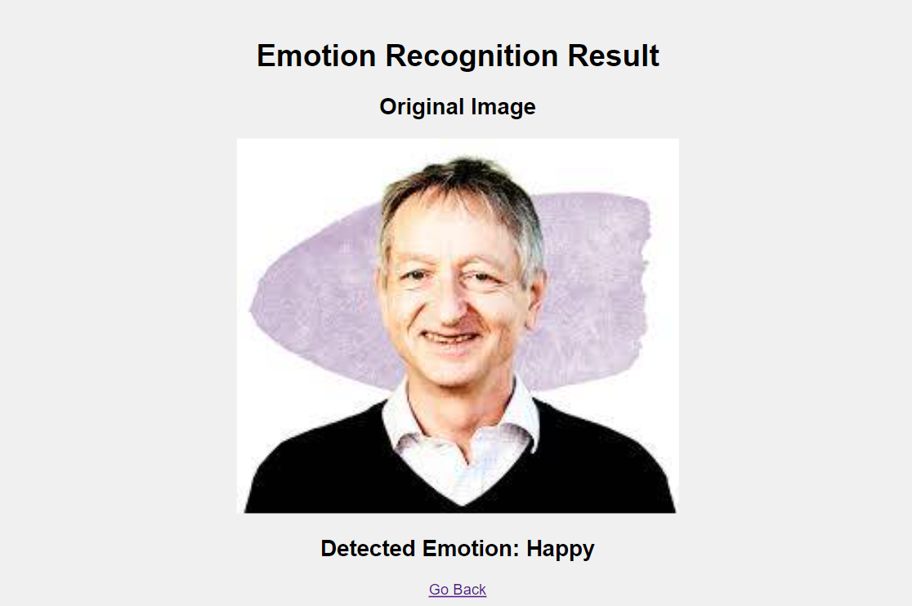

# Facial Emotion Recognition using YOLOv8

This project enables real-time facial emotion recognition using a YOLOv8 model integrated with a Flask web application. The system can classify the following emotions:
- Disgusted
- Surprised
- Angry
- Sad
- Happy
- Scared
- Neutral

### Application Screenshots
Here are some screenshots of the application in action:





## Table of Contents
- [Introduction](#introduction)
- [Installation](#installation)
- [Usage](#usage)
- [Project Structure](#project-structure)
- [Dataset](#dataset)
- [License](#license)

## Introduction

This project leverages the YOLOv8 model for detecting facial emotions. A custom dataset was created by translating emotion labels from Malay to English for improved usability. The Flask application provides a user-friendly interface for both uploading images and real-time emotion detection via webcam.

## Installation

1. **Clone the repository:**
   ```bash
   git clone https://github.com/hasnain3142/Facial-Emotion-Recognition.git
   cd Facial-Emotion-Recognition
   ```

2. **Set up a virtual environment:**
   ```bash
   python -m venv venv
   source venv/bin/activate  # On Windows use `venv\Scripts\activate`
   ```

3. **Install the required dependencies:**
   ```bash
   pip install -r requirements.txt
   ```

## Usage

1. **Run the Flask application:**
   ```bash
   python app.py
   ```

2. **Open your web browser and navigate to:**
   ```bash
   http://127.0.0.1:5000/
   ```

3. **Upload an image or use the webcam for real-time emotion detection.**


## Project Structure

- `app.py`: The main Flask application file.
- `requirements.txt`: List of dependencies required for the project.
- `templates/`: Directory containing HTML templates for the Flask app.
- `static/`: Directory for static files such as uploaded images.
- `models/`: Directory containing the trained YOLOv8 model.
- `train/`: Directory containing the training script.
- `README.md`: This documentation file.

## Dataset

- **Original Dataset:** [Expression Detection (Malay Labels)](https://universe.roboflow.com/fardhansyah-hanafi-d9mrp/expression-detection-yofhu)
- **Modified Dataset:** [Facial Emotion Recognition (English Labels)](https://www.kaggle.com/datasets/beinghasnain16/facial-emotion-recognition)

The original dataset's emotion labels were translated from Malay to English, and the modified dataset is available on Kaggle for use.

## License

This project is licensed under the MIT License. See the [LICENSE](LICENSE) file for details.

Feel free to contribute to this project by opening issues or submitting pull requests. Happy coding!